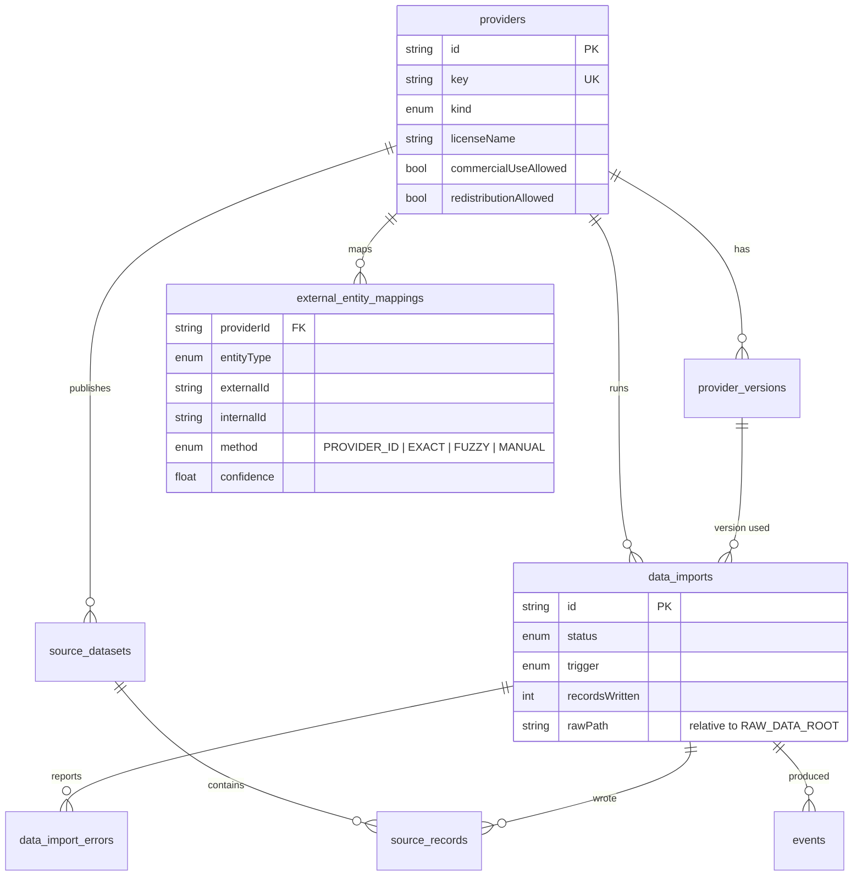
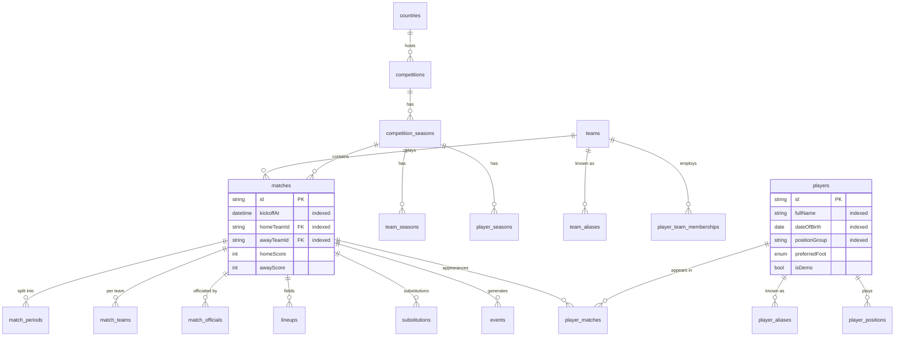
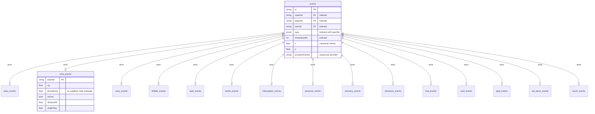
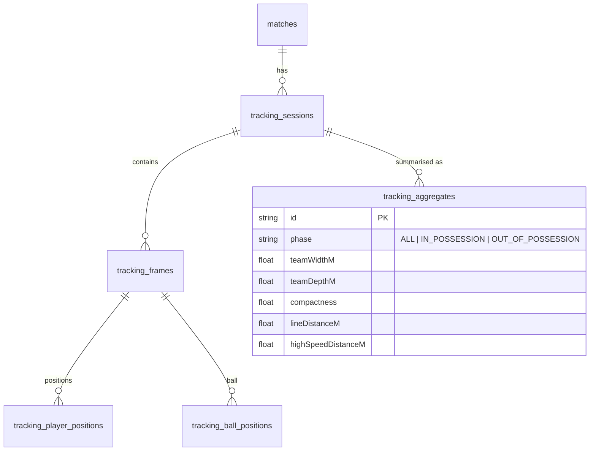
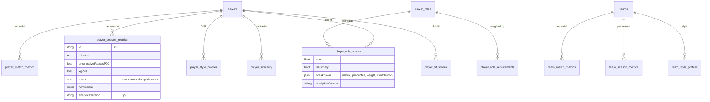
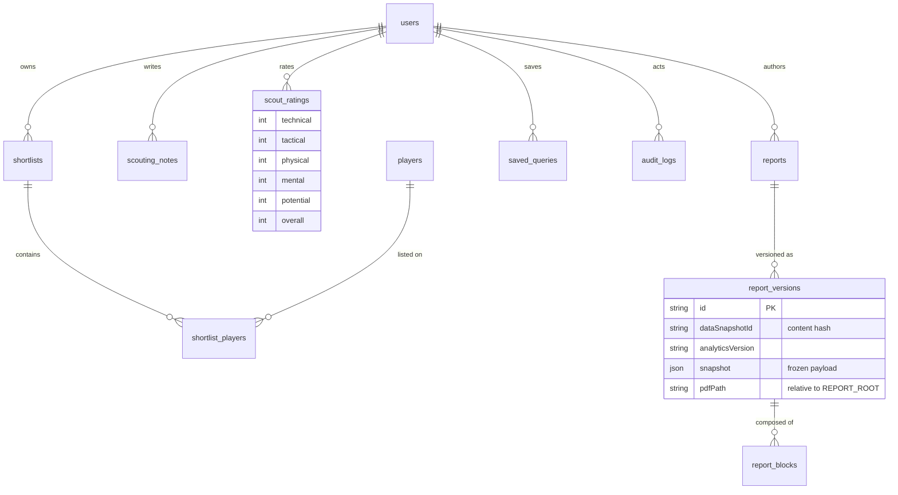

# Database model

ScoutIQ's schema is normalised and query-friendly (§20): foreign keys, indexes,
unique constraints, timestamps, and JSONB only where the shape is genuinely
open (provider settings, score breakdowns, frozen report snapshots).

- 73 tables, 12 views, 5 materialized views
- Reproducible on any PostgreSQL instance with `npm run db:migrate`
- Every imported row carries provenance (§11)

## Provenance and ingestion



Every fact answers "where did this number come from?": an event points at its
provider, provider version, import and the raw payload archived on disk.

## Football core



## Events

One base table with the columns every event shares, plus typed detail tables for
the families that carry their own attributes. Coordinates are always canonical
metres (105 × 68) after the transformation layer (§33).



## Tracking



Frames are stored so tracking is queryable in SQL, but the browser only ever
receives `tracking_aggregates` (§37, §59, §92).

## Derived analytics



Every derived row records the `analyticsVersion` that produced it, so formulas
can evolve without invalidating historical output (§53), and every score stores
the breakdown that explains it (§85).

## Scouting, reports and audit



Human scout ratings live in their own table and never enter the automated
analytics without an explicit configuration (§49).

## Indexes (§60)

Beyond every primary and foreign key:

| Table | Index |
| --- | --- |
| `players` | `fullName`, `lastName`, `dateOfBirth`, `positionGroup`, `countryId` |
| `teams` | `name` |
| `matches` | `kickoffAt`, `homeTeamId`, `awayTeamId`, `(competitionSeasonId, kickoffAt)` |
| `events` | `matchId`, `playerId`, `teamId`, `timestampMs`, `(matchId, timestampMs)`, `(matchId, type)`, `(playerId, type)`, unique `(providerId, providerEventId)` |
| `player_match_metrics` | `playerId`, `matchId` |
| `player_season_metrics` | `(competitionSeasonId, positionGroup)`, `playerId` |
| `tracking_player_positions` | `trackingFrameId`, `playerId` |
| `external_entity_mappings` | unique `(providerId, entityType, externalId)`, `(entityType, internalId)` |
| `audit_logs` | `createdAt`, `actorId`, `(entityType, entityId)` |

## Regenerating this document

The schema is the source of truth:

```bash
npx prisma studio                 # browse it
npx prisma migrate diff --from-empty --to-schema-datamodel prisma/schema.prisma --script
```
